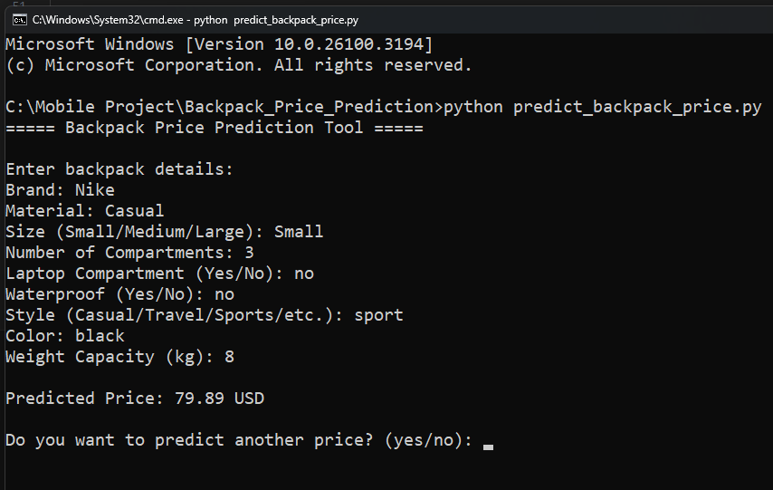

# Backpack Price Prediction using Machine Learning

This project aims to predict the price of backpacks using machine learning techniques. The dataset is sourced from Kaggle, and the model is trained using features like brand, material, size, and other specifications.

## Features
- 📊 **Data Preprocessing**: Cleans and transforms raw data into a structured format.
- 🤖 **Machine Learning Models**: Uses regression models to predict backpack prices.
- 📈 **Model Evaluation**: Analyzes performance using metrics like RMSE and R².
- 💻 **Command-Line Interface (CLI)**: Run predictions directly from the terminal.

## Technologies Used
- **Python** – Programming language
- **Pandas** – Data manipulation
- **NumPy** – Numerical computations
- **Scikit-learn** – Machine learning models
- **Matplotlib & Seaborn** – Data visualization

## Dataset
The dataset contains various backpack attributes such as:
- Brand
- Material
- Size & Dimensions
- Number of compartments
- Price (Target Variable)

## Installation Guide
1. **Clone the repository:**
   ```sh
   git clone https://github.com/AkinduIB/BackpackPricePrediction.git
   cd BackpackPricePrediction
   ```
2. **Install dependencies:**
   ```sh
   pip install -r requirements.txt
   ```
3. **Run the training script:**
   ```sh
   python train.py
   ```
4. **Make predictions using the CLI:**
   ```sh
   python predict.py --brand Nike --material Leather --size Medium
   ```

## Usage
1. **Run the training script** to train the model.
2. **Use the CLI** to predict the price of a backpack based on input features.
3. **Analyze model performance** using the evaluation script.

## Screenshots
**Command-Line Interface Example:**


## Model Performance
- **Mean Absolute Error (MAE):** _value_
- **Root Mean Square Error (RMSE):** _value_
- **R² Score:** _value_

## Future Improvements
🔹 Expand the dataset for better accuracy.  
🔹 Experiment with deep learning models.  
🔹 Build a web interface for easier usage.  

## Credits
Developed by **Your Name** for the Computational Intelligence assignment.

## License
This project is licensed under the MIT License - see the LICENSE file for details.

---
Feel free to contribute or suggest improvements! 🚀

